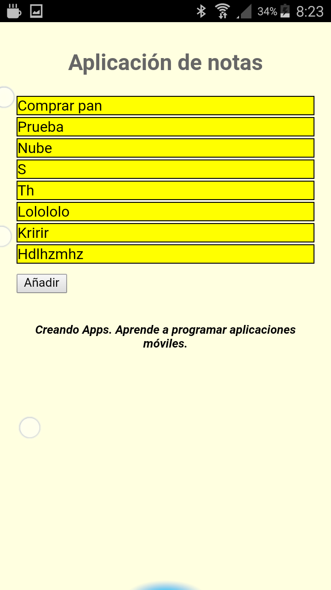

# Módulo 5: Datos

Aplicación para guardar notas, con posibilidad de almacenamiento en la nube.

## Paso 1

> [Commit `ccc88ea`](https://github.com/pacoqueen/ejercicios_phonegap/tree/ccc88ea1252d7eb13351abbe034cd85d1784e82b)

Esqueleto de la aplicación. Sin comportamiento. Solo un sencillo CSS.


## Paso 2

> [Commit `d0c065d`](https://github.com/pacoqueen/ejercicios_phonegap/tree/d0c065d0804ec903e9d4f18177415726e85b3822)

Se añade la funcionalidad de crear nuevas notas.

## Paso 3

> [Commit `02e4845`](https://github.com/pacoqueen/ejercicios_phonegap/tree/02e48457f680053f63b8474ee1499e1f4721379a)

Se agrega persistencia para que las nuevas notas no se pierdan al reiniciar la aplicación.

La primera vez que se ejecuta, falla porque no existe el fichero `Andoid\data\com.adobe.phonegap.files\model.json` y el `leerDatos`, al no poder abrir el fichero, no llega a ejecutar el `app.inicio`.

Se puede, bien crear el fichero vacío a mano, o bien cambiar descomentar la línea 150 y comentar la 151 para que la aplicación cargue y se pueda guardar una primera nota.

```javascript
if('addEventListener' in document){
  document.addEventListener('deviceready', function() {
    console.log("Aplicación iniciada. Leyendo datos...");
    app.inicio();
    //app.leerDatos();
  }, false);
```

## Paso 4

> [Commit `bbd2df7`](https://github.com/pacoqueen/ejercicios_phonegap/tree/bbd2df7fd7194b2ac870b588c8841db4b5d1f3fc)

Se guarda una copia de seguridad de los datos en la nube usando la biblioteca _Firebase_. La configuración de _Firebase_ se establece en un fichero aparte (`www/js/config.js`) que no se incluye en el repositorio por motivos de seguridad.

El fichero contiene, casi sin cambios, el [fragmento de código proporcionado por el propio _Firebase_](https://console.firebase.google.com/u/0/):

```javascript
  // Initialize Firebase
  var config = {
    apiKey: "YourOwnApiKeyHere_aslasdOUASDOUasdp9a89",
    authDomain: "yourapp.firebaseapp.com",
    databaseURL: "https://yourapp.firebaseio.com",
    projectId: "yourapp",
    storageBucket: "yourapp.appspot.com",
    messagingSenderId: "648767168764"
  };
```

Este fichero debe importarse en el `index.html` para que la variable establecida pueda ser accedida por `notes.js`.

Por defecto los proyectos en _Firebase_ se crean con una [regla de seguridad](https://firebase.google.com/docs/storage/security/start?authuser=0) para _Storage_ que obliga a que los usuarios estén autenticados para poder guardar ficheros:
```
service firebase.storage {
  match /b/{bucket}/o {
    match /{allPaths=**} {
      allow read, write: if request.auth != null;
    }
  }
}
```

Hay que editarla para permitir el acceso público (sin autenticación de usuario):
```
// Anyone can read or write to the bucket, even non-users of your app.
// Because it is shared with Google App Engine, this will also make
// files uploaded via GAE public.
service firebase.storage {
  match /b/{bucket}/o {
    match /{allPaths=**} {
      allow read, write;
    }
  }
}
```

---



Servir la aplicación desde el ordenador con
```
phonegap serve
```
Y lanzarla en el móvil con [PhoneGap Developer App](http://docs.phonegap.com/getting-started/2-install-mobile-app/).
