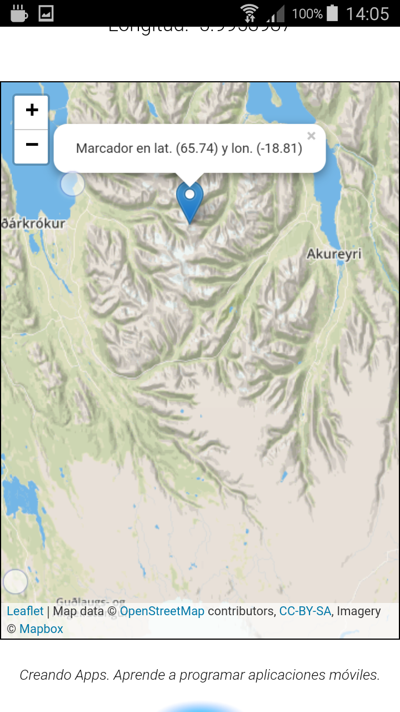

# Módulo 3: Localización

Aplicación para geolocalizar el móvil, mostrar un mapa y guardar lugares favoritos.

## Paso 1

> [Commit `78c5b10`](https://github.com/pacoqueen/ejercicios_phonegap/tree/78c5b1029ca03a9102595c4bb00fd7d668f9bed4)

Obtener las coordenadas de la posición del móvil.

## Paso 2

> [Commit `43fbcbd`](https://github.com/pacoqueen/ejercicios_phonegap/tree/43fbcbd928b95e6e6ece5d307060af3df4f75f21)

Dibujar un mapa según las coordenadas del paso anterior. La porción del mapa a dibujar se descargará de [mapbox](http://www.mapbox.com/) usando la biblioteca [leaflet](http://leafletjs.com/examples/quick-start/). `leaflet.js` debe extraerse en `www/js`, mientras que `leaflet.css` y el directorio `images` deben estar en `www/css`.

Para acceder a los mapas es necesario registrarse en Mapbox y generar un _Access Token_ que se usa en la función `dibujaCoordenadas` de `www/js/maps.js`. El _Access Token_ debe guardarse en el fichero `www/js/config.js` —no incluido en el repositorio—, que contendría:

```
var config = {
    MAPBOX_APIKEY: 'pk.eyTUACCESSTOKENAQUItuaccesstokenaquiTUACCESSTOKENAQUItuaccesstokenaqui.Mlajkshdan'
}
```

## Paso 3

> [Commit 06f86e6](https://github.com/pacoqueen/ejercicios_phonegap/tree/c6f86e6de73ae88be6697f8df882e8471f6c2309)

Añade la funcionalidad de crear marcadores en el mapa al pulsar. Cada marcador abre un diálogo emergente con las coordenadas.

---



Servir la aplicación desde el ordenador con
```
phonegap serve
```
Y lanzarla en el móvil con [PhoneGap Developer App](http://docs.phonegap.com/getting-started/2-install-mobile-app/).

