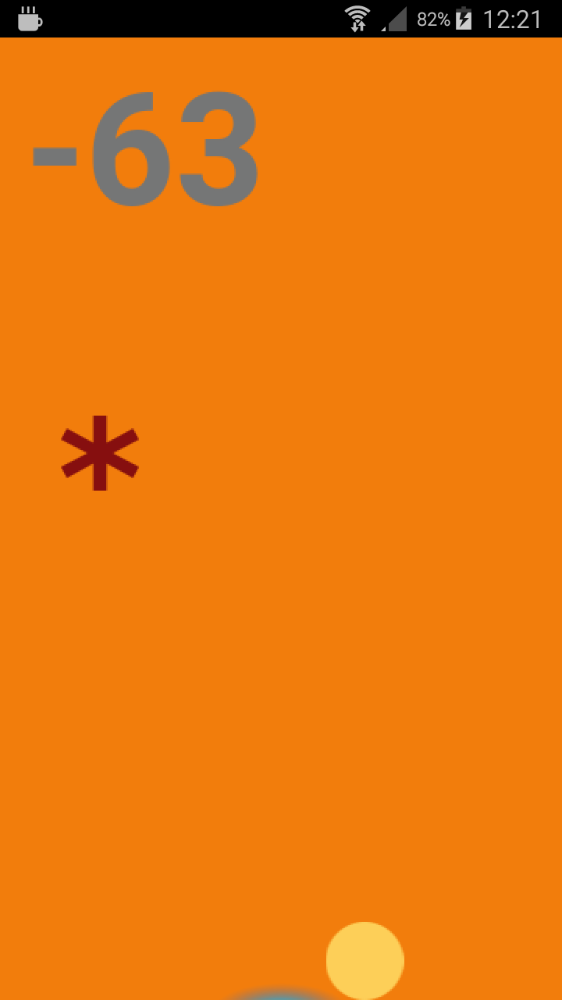

# Módulo 4: Sensores


## Paso 1

> [Commit `6c68c5f`](https://github.com/pacoqueen/ejercicios_phonegap/tree/6c68c5fa9a48955115f09ae9f009457f324dbf73)

Lectura de los valores del acelerómetro con `watchAcceleration`.

## Paso 2

> [Commit `9132952`](https://github.com/pacoqueen/ejercicios_phonegap/tree/91329523598dba2ce295fe691ab19a88d01bcdad)

Se usa la biblioteca [Phaser](https://phaser.io/download/stable) como _framework_ del juego. Con el acelerómetro detectamos la inclinación del móvil para mover una bola por la pantalla. Si toca los bordes, la puntuación decrementa en 1.

## Paso 3

> [Commit `602cd71`](https://github.com/pacoqueen/ejercicios_phonegap/tree/602cd71e7be780f4278058f4ea179034431addad)

Añadiendo jugabilidad: Debemos movel la bola a un objetivo para aumentar la puntuación. Cada vez que se suma un punto, el objetivo se coloca en una nueva posición y aumenta la velocidad de la bola si la puntuación es positiva. Para reiniciar el juego, agitar el móvil.

---



Servir la aplicación desde el ordenador con
```
phonegap serve
```
Y lanzarla en el móvil con [PhoneGap Developer App](http://docs.phonegap.com/getting-started/2-install-mobile-app/).

